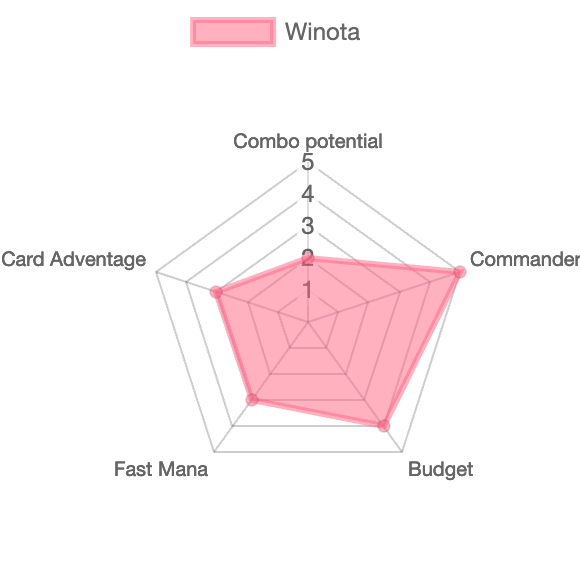

# EDHDeckRater

When playing casual EDH it is often a complicated discussion to evaluate the power level of decks. I propose a automated grader based on somewhat objective criterion.

The input should be a decklist (I will start to work to import decklist from deckstats) and the output a radar chart of different stats for the deck.

I want to develop multiple score categories each ranging from 1 to 5

The end result should look similar to this



Metrics ideas

### Budget

The deck price is often a pretty good proxy metric for power level (even if sometimes, for some outliers this is not the case at all).

The application should be able to find the cheapest price for each card in the deck and sum it.

My idea is that each 200 \$ would add 1 point, leading to 5 point for a deck over 1000 \$

### Fast mana potential

Some cards are known for producing fast mana, those cards could receive a score and then the sum of such scores would give the deck a grading.

e.g.

* sol ring: .5
* mana crypt .5
* moxes .3
* dockside: .5
* ...

### Card advantage / Tutor potential

The potential of the deck to see cards, includes card draw but also tutors

### Fast win potential

The goal here is to check the number of combo available in the deck againt a database like https://commanderspellbook.com/

Also some instant win cards would be flagged (e.g. approach of the second sun)

Maybe some cards that tend to win when played could be marked (thassa's oracle, livind death, ...)

Some aggro cards could be marked:

### Commander rating

This commander grading could be based on a elo tier or winrate. I don't know if we can get stats from MTG online for instance

### Control potential

Some cards could be marked as control, removals, wrath, stax.

based on the number of such cards in the deck we could infer a score.

### Salt level

Based on EDHREC salt level.

## Project Structure

```text
edh_deck_rater
|-- bin/                         # CLI scripts
|-- notebooks
|   |-- *.ipynb                  # Jupyter notebooks
|   `-- my_nb_path.py            # Imported by *.ipynb to treat src/ as PYTHONPATH
|-- requirements/                # Dependencies required by this project
|-- src                          # Python modules developed in this project
|   `-- my_nb_color.py           # Imported by *.ipynb to colorize their outputs
|-- tests/                       # Unit tests

# Miscellaneous files
|-- .editorconfig                # Editor config (for IDE / editor that support this)
|-- .gitattributes               # Files that Git must give special treatments
|-- .gitignore                   # Git ignore list
|-- .pre-commit-config.yaml      # Precommit hooks
|-- LICENSE                      # License
|-- README.md                    # Template document
|-- pyproject.toml               # Settings for select Python toolchains
`-- tox.ini                      # Settings for select Python toolchains
```

## Credits

This project was initialized by Jean-Baptiste de la Broise using:

```bash
cookiecutter https://github.com/aws-samples/python-data-science-template
```

## License

This library is licensed under the MIT License. See the [LICENSE](LICENSE) file.
